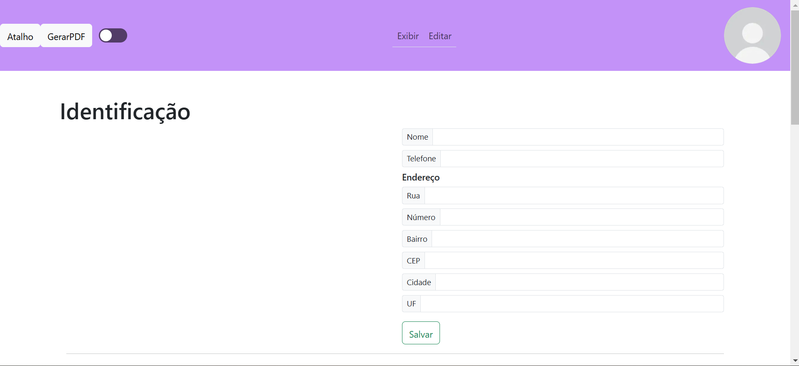

# Curriculo Dinâmico
Esse currículo foi desenvolvido como parte de um projeto final do Curso de Desenvolvimento Full Stack da Treina Recife, sob orientação do professor João Ferreira.
## 🛠️ Tecnologias Utilizadas
- JavaScript, CSS
- REACT com Vite
- Bootstrap 5.3
- Java API, SpringBoot

## **SpringAPI**
A API foi desenvolvida utilizando Spring Boot para fornecer serviços ao frontend. Ela permite a gestão de usuários e a gestão de dados do sistema.

## *Pré-requisitos*
Antes de começar, certifique-se de ter os seguintes itens instalados no seu computador:
- **Java 17** → [Baixar aqui](https://www.oracle.com/br/java/technologies/downloads/)
- **Maven** → [Baixar aqui](https://www.oracle.com/br/java/technologies/downloads/)
- **Editor de código** (VSCode) → [Baixar aqui](https://code.visualstudio.com/)
- **Gerenciador de banco de dados Mysql** (MySQL) → [Baixar aqui](https://www.mysql.com/downloads/)
  
## Como Executar Localmente

**1. Clonar o Repositório do GitHub**
- Abra o terminal e execute o seguinte comando:
```sh
git clone https://github.com/liliwili/projetoTreina.git
```
**2. Depois, entre na pasta do projeto clonado:**
```sh
cd projetoTreina/backend
```
**3. Configurar banco de dados**
- Atualize o arquivo application.properties com as credenciais do seu banco de dados e crie um schema.
  
**4. Executar a API**
- Agora, inicie o servidor springboot com o comando:
```sh
mvn clean install
mvn spring-boot:run
```
- A API estará disponível no endereço `http://localhost:8080/`.

## **Frontend**
O frontend foi desenvolvido para exibir o curriculo dinamico com uma interface responsiva e intuitiva utilizando React com vite.



## *Pré-requisitos*
Antes de começar, certifique-se de ter os seguintes itens instalados no seu computador:
- **Node.js** (inclui o npm) → [Baixar aqui](https://nodejs.org/)
- **Editor de código** (VSCode) → [Baixar aqui](https://code.visualstudio.com/)
  
## Como Executar Localmente
**1. Clonar o Repositório do GitHub**
- Abra o terminal e execute o seguinte comando:
```sh
git clone https://github.com/liliwili/projetoTreina.git
```
**2. Depois, entre na pasta do projeto clonado:**
```sh
cd projetoTreina/frontend
```
**3. Instalar as Dependências**
- Dentro da pasta do projeto, execute:
```sh
npm install
npm install react-bootstrap bootstrap
npm install html2canvas
npm install jspdf
npm run dev

```
- Isso instalará todas as bibliotecas necessárias para rodar o projeto.

  
**4. Rodar o Servidor do React+Vite**
- Agora, inicie o servidor com o comando:
```sh
npm run dev
```
- Isso abrirá o projeto no navegador no endereço padrão `http://localhost:5173/`.

## Contato
📧 Email: [wilianevitoria683@gmail.com](mailto:wilianevitoria683@gmail.com)  
💼 LinkedIn: [Wiliane Vitoria](https://www.linkedin.com/in/wiliane-vitoria-maria-da-silva-627754270/)  
🐙 GitHub: [LiliWili](https://github.com/LiliWili)
## Autores
<em>-João Ferreira<a href="https://github.com/joaoferreirape"> github</a></em>
<em>- Wiliane Vitoria</em>
## 📜 Licença
Este projeto está sob a licença MIT - veja o arquivo [LICENSE](LICENSE) para detalhes.
